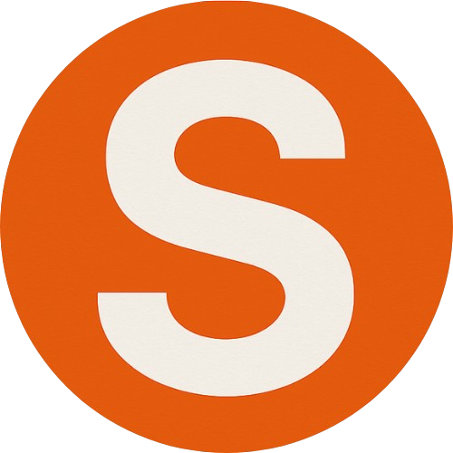
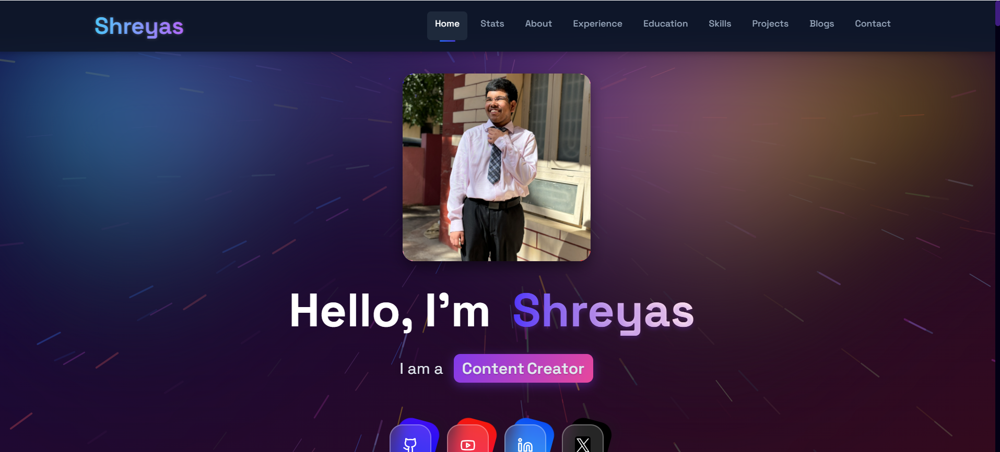
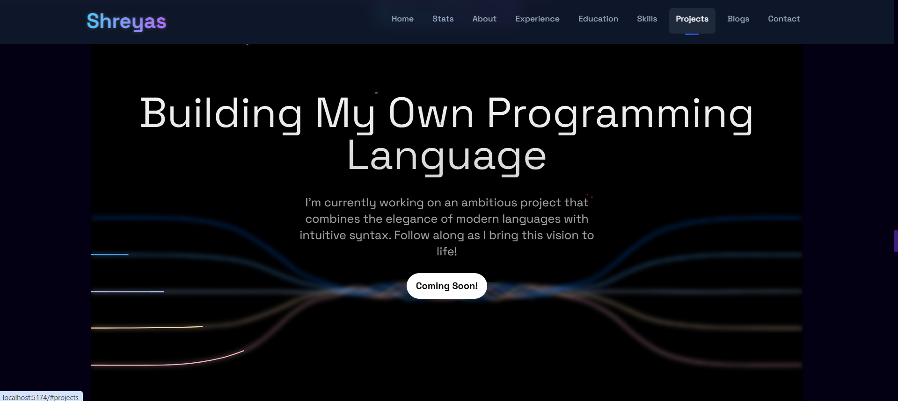
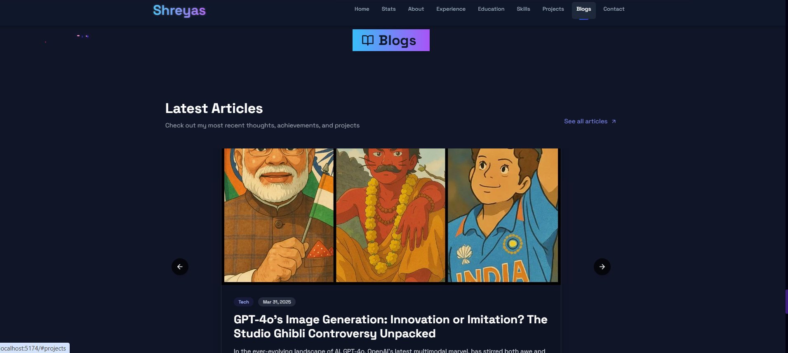

# Shreyas J - Personal Portfolio

<div align="center">
  
  <h3>A modern, responsive portfolio website showcasing my projects, skills, and blog.</h3>
  <p><a href="https://iamshreyas.live" target="_blank">View Live Demo</a> · <a href="https://github.com/SmartKidzee/new_portfolio/issues/new" target="_blank">Report Bug</a> · <a href="https://github.com/SmartKidzee/new_portfolio/issues/new" target="_blank">Request Feature</a></p>
</div>

## ✨ Features

- 🎨 **Modern UI/UX** - Sleek design with Tailwind CSS and Framer Motion animations
- 📱 **Responsive Design** - Works flawlessly on all device sizes
- 🚀 **Performance Optimized** - Lazy loading, code splitting, and asset optimization
- 📝 **Dynamic Blog System** - Showcase your writing with a full-featured blog
- 🔍 **SEO Optimized** - Meta tags, structured data, and sitemap for better indexing
- 🌙 **Animations & Effects** - Custom cursor trails, scroll animations, and interactive elements
- 📊 **Project Showcase** - Highlight your best work with detailed project pages
- 📬 **Contact Form** - Easy to use contact system for networking

## 🛠️ Built With

- **Frontend Framework**: [React](https://reactjs.org/) with [TypeScript](https://www.typescriptlang.org/)
- **Styling**: [Tailwind CSS](https://tailwindcss.com/)
- **Build Tool**: [Vite](https://vitejs.dev/)
- **Animations**: [Framer Motion](https://www.framer.com/motion/)
- **Routing**: [React Router](https://reactrouter.com/)
- **3D Effects**: [Three.js](https://threejs.org/)
- **SEO**: [React Helmet](https://github.com/nfl/react-helmet) & custom SEO components
- **Deployment**: Optimized for various hosting platforms

## 🚀 Getting Started

### Prerequisites

- Node.js (v16.x or higher)
- npm or yarn

### Installation

1. Clone the repository
   ```bash
   git clone https://github.com/SmartKidzee/new_portfolio.git
   cd new_portfolio
   ```

2. Install dependencies
   ```bash
   npm install
   # or
   yarn
   ```

3. Start the development server
   ```bash
   npm run dev
   # or
   yarn dev
   ```

4. Open [http://localhost:5173](http://localhost:5173) in your browser

### Building for Production

```bash
npm run build
# or
yarn build
```

The optimized production build will be available in the `dist` folder.

## 📁 Project Structure

```
src/
├── components/       # Reusable UI components
├── pages/            # Page components for routing
├── data/             # Data files (blogs, projects, etc.)
├── styles/           # Global styles and Tailwind config
├── lib/              # Utility functions and helpers
├── hooks/            # Custom React hooks
├── assets/           # Static assets (images, fonts, etc.)
└── App.tsx           # Main application component
```

## 📄 Adding Content

### Blog Posts

Add new blog posts in `src/data/blogs.ts`:

```typescript
{
  id: '6',
  category: "Tech",
  title: "Your New Blog Title",
  content: "Your blog content with markdown support...",
  created_at: "2023-04-01",
  updated_at: "2023-04-01",
  tags: ["Tag1", "Tag2"],
  src: 'https://example.com/your-image.jpg'
}
```

### Projects

Add new projects in the projects data file.

## 📝 SEO Features

This portfolio includes comprehensive SEO optimizations:

- Structured data for rich search results
- Dynamic meta tags for all pages
- Sitemap generation
- OpenGraph and Twitter card support
- Canonical URLs

## 🤝 Connect with Me

- GitHub: [@SmartKidzee](https://github.com/SmartKidzee)
- LinkedIn: [Shreyas J](https://linkedin.com/in/smartshreyas)
- X: [@kidzeesmart](https://x.com/kidzeesmart)
- Instagram: [@smartkidzee](https://instagram.com/smartkidzee)

## 📸 Screenshots

<details>
  <summary>View Screenshots</summary>
  <div align="center">
    <p><i>Screenshots</i></p>
    
    
    
    -->
  </div>
</details>

## 📋 Roadmap

- [ ] Add localization support for multiple languages
- [ ] Implement dark/light theme toggle
- [ ] Add more interactive project showcases
- [ ] Integrate a headless CMS for content management

## 📄 License

Distributed under the MIT License. See `LICENSE` for more information.

## 🙏 Acknowledgments

- Design inspiration from various modern portfolio websites
- Icons from [Lucide Icons](https://lucide.dev/)
- 3D effects inspired by [Awwwards](https://www.awwwards.com/) winning sites

---

<div align="center">
  <p>Made with ❤️ by <a href="https://github.com/SmartKidzee">Shreyas J</a></p>
  <p>©️ 2023-2025 Shreyas J. All Rights Reserved.</p>
</div> 