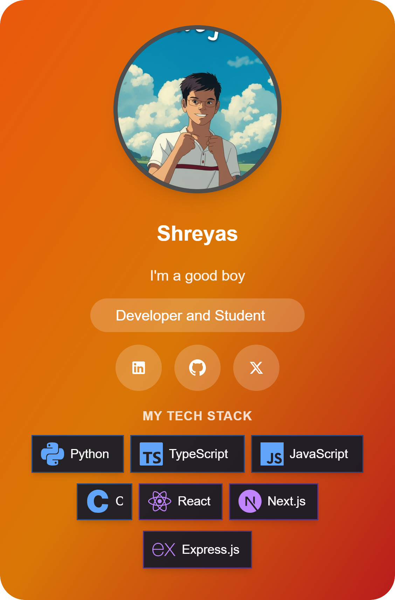

# Shreyas J - Personal Portfolio

<div align="center">
  
  <h3>A modern, responsive portfolio website showcasing my projects, skills, and blog.</h3>
  <p><a href="https://iamshreyas.live" target="_blank">View Live Demo</a> · <a href="https://github.com/SmartKidzee/new_portfolio/issues/new" target="_blank">Report Bug</a> · <a href="https://github.com/SmartKidzee/new_portfolio/issues/new" target="_blank">Request Feature</a></p>
</div>

## ✨ Features

- 🎨 **Modern UI/UX** - Sleek design with Tailwind CSS and Framer Motion animations
- 📱 **Responsive Design** - Works flawlessly on all device sizes
- 🚀 **Performance Optimized** - Lazy loading, code splitting, and asset optimization
- 📝 **Dynamic Blog System** - Showcase your writing with a full-featured blog
- 🔍 **SEO Optimized** - Meta tags, structured data, and sitemap for better indexing
- 🌙 **Animations & Effects** - Custom cursor trails, scroll animations, and interactive elements
- 📊 **Project Showcase** - Highlight your best work with detailed project pages
- 📬 **Contact Form** - Easy to use contact system for networking
- 🔮 **Glassmorphism Elements** - Apple-inspired glassmorphism UI components for modern aesthetic
- 📊 **Interactive Blog Tables** - Beautifully styled tables with rounded corners and glassmorphism effects
- 🧹 **Optimized Codebase** - Clean, well-organized code structure with unnecessary files removed
- 🎴 **Tech Card Builder** - Create and share personalized tech stack cards with your programming skills
- 🖥️ **Desktop-Stable, Mobile-Beta** - Tech Card Builder is fully stable on desktop devices, currently in beta for mobile users
- 🔄 **Social Sharing** - Share tech cards directly to WhatsApp, X (Twitter), or copy shareable links
- 📥 **Mobile Optimized Downloads** - Download tech cards on any device with automatic mobile detection
- 📄 **Terms & Conditions** - Professional legal terms page with clear guidelines for site usage and Tech Card Builder

## 🛠️ Built With

- **Frontend Framework**: [React](https://reactjs.org/) with [TypeScript](https://www.typescriptlang.org/)
- **Styling**: [Tailwind CSS](https://tailwindcss.com/)
- **Build Tool**: [Vite](https://vitejs.dev/)
- **Animations**: [Framer Motion](https://www.framer.com/motion/)
- **Routing**: [React Router](https://reactrouter.com/)
- **3D Effects**: [Three.js](https://threejs.org/)
- **Database**: [Firebase Firestore](https://firebase.google.com/docs/firestore) for tech card storage
- **Image Processing**: [html-to-image](https://github.com/bubkoo/html-to-image) for card generation
- **SEO**: [React Helmet](https://github.com/nfl/react-helmet) & custom SEO components
- **Deployment**: Optimized for various hosting platforms

## 🚀 Getting Started

### Prerequisites

- Node.js (v16.x or higher)
- npm or yarn

### Installation

1. Clone the repository
   ```bash
   git clone https://github.com/SmartKidzee/new_portfolio.git
   cd new_portfolio
   ```

2. Install dependencies
   ```bash
   npm install
   # or
   yarn
   ```

3. Start the development server
   ```bash
   npm run dev
   # or
   yarn dev
   ```

4. Open [http://localhost:5173](http://localhost:5173) in your browser

### Building for Production

```bash
npm run build
# or
yarn build
```

The optimized production build will be available in the `dist` folder.

## 📁 Project Structure

```
src/
├── components/       # Reusable UI components
├── pages/            # Page components for routing
├── data/             # Data files (blogs, projects, etc.)
├── styles/           # Global styles and Tailwind config
├── lib/              # Utility functions and helpers
├── hooks/            # Custom React hooks
├── assets/           # Static assets (images, fonts, etc.)
└── App.tsx           # Main application component
```

## 📄 Adding Content

### Blog Posts

Add new blog posts in `src/data/blogs.ts`:

```typescript
{
  id: '6',
  category: "Tech",
  title: "Your New Blog Title",
  content: "Your blog content with markdown support...",
  created_at: "2023-04-01",
  updated_at: "2023-04-01",
  tags: ["Tag1", "Tag2"],
  src: 'https://example.com/your-image.jpg'
}
```

### Adding Blog Tables

You can add beautiful tables to your blog posts using the `<BlogTable>` component:

```typescript
<BlogTable
  headers={["Header1", "Header2", "Header3"]}
  rows={[
    {
      "Header1": "Row 1, Cell 1",
      "Header2": "Row 1, Cell 2",
      "Header3": "Row 1, Cell 3"
    },
    {
      "Header1": "Row 2, Cell 1",
      "Header2": "Row 2, Cell 2",
      "Header3": "Row 2, Cell 3"
    }
  ]}
/>
```

These tables automatically include:
- Rounded corners for a modern look
- Apple-style glassmorphism effect
- Responsive design for all screen sizes
- Alternating row colors for better readability

### Projects

Add new projects in the projects data file.

## 📝 SEO Features

This portfolio includes comprehensive SEO optimizations:

- Structured data for rich search results
- Dynamic meta tags for all pages
- Sitemap generation
- OpenGraph and Twitter card support
- Canonical URLs

## 🤝 Connect with Me

- GitHub: [@SmartKidzee](https://github.com/SmartKidzee)
- LinkedIn: [Shreyas J](https://linkedin.com/in/smartshreyas)
- X: [@kidzeesmart](https://x.com/kidzeesmart)
- Instagram: [@smartkidzee](https://instagram.com/smartkidzee)

## 📸 Screenshots

<details>
  <summary>View Screenshots</summary>
  <div align="center">
    <p><i>Screenshots</i></p>
    
    
    
    -->
  </div>
</details>

## 📋 Roadmap

- [ ] Add localization support for multiple languages
- [ ] Implement dark/light theme toggle
- [ ] Add more interactive project showcases
- [ ] Integrate a headless CMS for content management
- [ ] Expand glassmorphism UI elements across more components

## 🎴 Tech Card Builder

The Tech Card Builder is a web application that allows you to create beautiful tech cards showcasing your tech stack. You can customize your profile, select technologies, and share your tech card with others.

<div align="center">
  
</div>

**Note: The Tech Card Builder is currently stable on desktop devices but in beta on mobile platforms. For the best experience, we recommend using a desktop browser. We're actively improving the mobile experience.**

**Mobile Browser Compatibility:** Some features like direct downloads may behave differently across mobile browsers. If you encounter issues with downloads on mobile, you can use the "Copy Link" button to view your card in a new tab and save it from there.

Features:
- Customize your profile with name, bio, and profile picture
- Select from a wide range of technologies across different categories
- Drag and drop to arrange your tech stack
- Share your tech card on social media
- Download your tech card as an image
- Each tech card gets a unique shareable URL

## 📄 Terms & Conditions

The website includes a comprehensive Terms & Conditions page that covers legal aspects of using the site and its features, particularly the Tech Card Builder.

### What's Covered

- **Website Ownership** - Clear declaration of site ownership
- **Intellectual Property Rights** - Protection of website content and design
- **User Content Guidelines** - Rules for Tech Card Builder uploads
- **Limitation of Liability** - Protection against misuse and damage
- **Acceptable Use Policy** - Guidelines for proper website usage
- **Governing Law** - Legal jurisdiction for the website
- **Privacy Protection** - How we handle and protect your personal information
- **Data Security** - Measures taken to secure data stored in Firebase
- **Mobile Compatibility** - Information about mobile browser limitations

### Privacy & Data Security

Your privacy is important to us. When using the Tech Card Builder:
- Your tech card data is stored securely in Firebase
- We only collect the information necessary to provide the service
- We don't share your personal information with third parties
- You retain ownership of the content you create

The Terms & Conditions page helps protect both the website owner and users by establishing clear expectations and legal boundaries. It's accessible via a link in the site footer on all pages.

## 🧹 Recent Updates

- Updated footer to include both Terms & Conditions and Privacy Policy links
- Enhanced mobile compatibility details for the Tech Card Builder feature
- Added Privacy and Data Security section to the README and terms page
- Added Terms & Conditions page with comprehensive legal guidelines
- Added new Tech Card Builder feature for creating shareable developer profiles
- Implemented Firebase integration for storing and retrieving tech cards
- Added direct app sharing to WhatsApp and X (Twitter) with mobile optimization
- Improved mobile experience for the tech card builder with responsive design
- Added Apple-style glassmorphism effect to blog tables
- Fixed blog parsing to properly render complex components
- Improved rendering of markdown elements in blog posts
- Removed unnecessary files for a cleaner codebase
- Enhanced table styling with subtle rounded corners and improved spacing

## 📄 License

Distributed under the MIT License. See `LICENSE` for more information.

## 🙏 Acknowledgments

- Design inspiration from various modern portfolio websites
- Icons from [Lucide Icons](https://lucide.dev/)
- 3D effects inspired by [Awwwards](https://www.awwwards.com/) winning sites
- Glassmorphism design inspired by Apple's UI aesthetics

---

<div align="center">
  <p>Made with ❤️ by <a href="https://github.com/SmartKidzee">Shreyas J</a></p>
  <p>©️ 2023-2025 Shreyas J. All Rights Reserved.</p>
</div> 